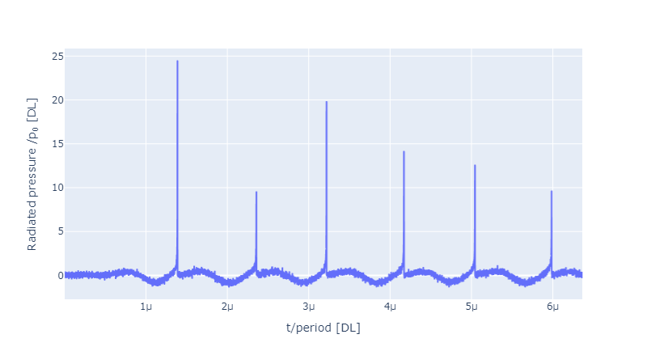
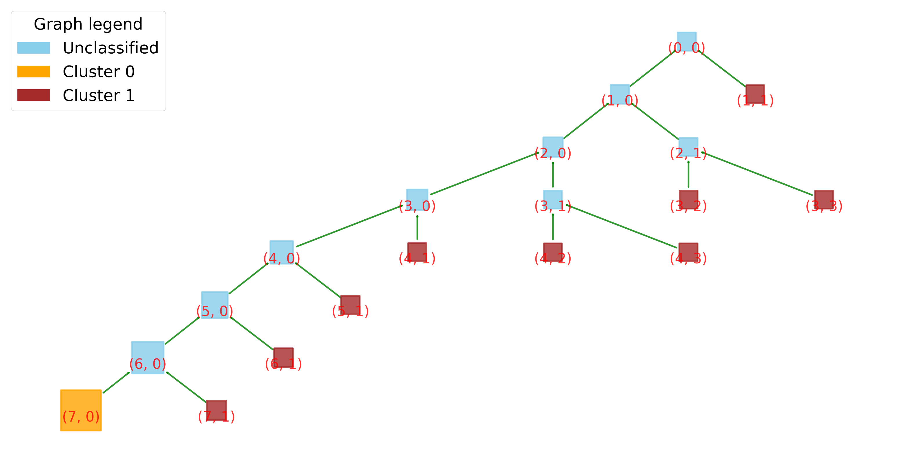
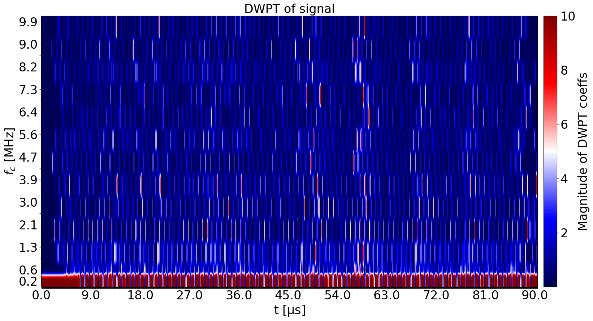
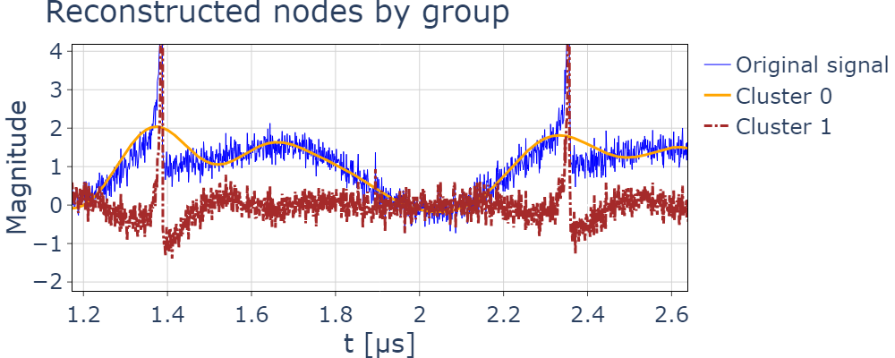

# WPT-Cavitation
A python library for processing 1D time-seriers data using discrete wavelet transforms and machine learning. 

The main features are:

- a 1D implementation of the discrete wavelet transform (DWT) and discrete wavelet packet transform (DWPT)
- inverse transforms which can reconstructed based on selected nodes individually
- minimum entropy decomposition to automatically identify the maximum level of(depth) of decomposition
- decomposition for nodes under a selected frequency threshold
- characterising nodes by their statistical features
- bubble dynamics simulations with the Gilmmore-Akulichev model
- visualisation with tree diagrams for DWT/DWPT, spectrograms and Heisenberg plots
- classification of nodes with clustering algorithms

The wavelet transform has been tested against results from the PyWavelets library and MATLAB. The implementation of the DWT/DWPT only relies on filter coefficients of the wavelet functions which can be imported manually (for any customised wavelet function) or use a family of wavelet functions available in PyWavelets.

This library was developed as part of an ongoing project associated with an upcoming paper: *Quantitative Detection and Classification of Acoustic Cavitation Using Wavelet Packet Transform and k-Means Clustering*

## Examples
The `notebooks` folder includes example codes illustrating the use of the library for simulating acoustic emissions by solving the bubble dynamics. Th emissions are then processed using the algorithm explained in the above mentioned paper. The figure below depicts acoustic emissions from a bubble undergoing transient cavitation:



The emissions are processed using a `Daubechies wavelet`. The decomposition is asymmetric. Tree plot of the discrete wavelet packet transform is shown below. The node size is corresponding to the energy of the DWPT coefficients of the node.



Heisenberg plot of the wavelet packet coefficients show time-frequency distribution of nodes (which are multi-resolution):



Finally, after classifying the DWPT nodes into periodic (Cluster 0) and transient (Cluster 1) components, the clustered nodes are reconstructed to obtain decomposed time-series:




## Installation
This library can be used by cloning and pulling from main.
WPT-Cavitation is dependent on NumPy, SciPy, PyWavelets, and scikit-learn for the k-means algorithm. Plotting requires matplotlib, plotly, and pygraphviz.

## Get help
Contact on GitHub or at max.au-yeung20@ucl.ac.uk.

## Acknowledgement
This work was partially supported by the Focused Ultrasound Foundation, and the UCL Mechanical Engineering department.

## Licence
WPT-Cavitation is licensed under an MIT licence. Full text of the licence can be found [here](LICENSE.md).

## Citation
If you use WPT-Cavitation in your work, please cite it as follows:

**APA**
```
Au-Yeung, M., & Haqshenas, R. (2024). WPT-Cavitation Analysis. https://github.com/USonixGroup/wpt-cavitation/
```

**BibTeX**
```
@software{WPT-Cavitation_Analysis_2024,
author = {Au-Yeung, Max and Haqshenas, Reza},
title = {{WPT-Cavitation Analysis}},
url = {https://github.com/USonixGroup/wpt-cavitation/},
version = {0.1.0},
year = {2024}
}
```
